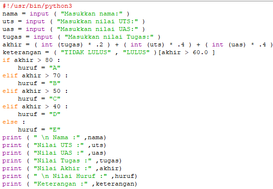
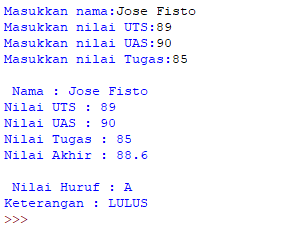
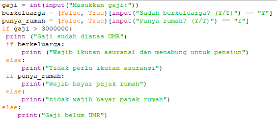
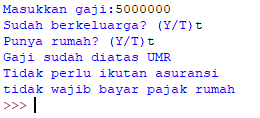
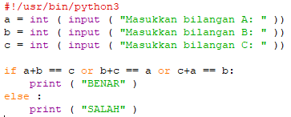
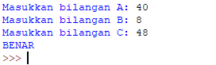
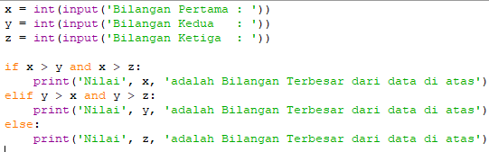
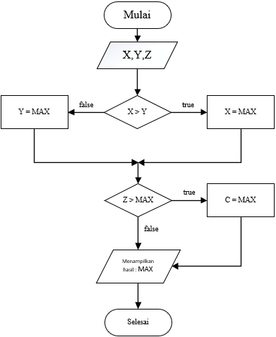
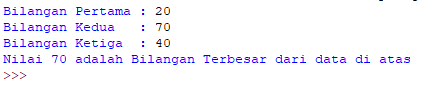

	BAHASA PEMROGRAMAN

	MODUL PRAKTIKUM 2 STRUKTUR KONDISI

	Dosen : Agung Nugroho, M.Kom

 
	<b>Tugas untuk memenuhi syarat penilain pada Pert-7</b>

	

                 Nama : Jose Fisto

                 NIM : 312010119

                 Kelas : TI.20 A.1

	

	<b>UNIVERSITAS PELITA BANGSA</b>

	<b>FAKULTAS TEKNIK</b>

	<b>TEKNIK INFORMATIKA</b>

	<b>TA 2020 / 2021</b>

# Modul Praktikum 2 Struktur Kondisi

## Latihan 1: Membuat program menentukan nilai akhir

Output atau hasil pada layar :

## Latihan 2: Membuat program menampilkan status gaji karyawan.

Output atau hasil pada layar :

## Latihan 3: penggunaan kondisi OR
program membandingkan 3 input bilangan, apabila penjumlahan 2 bilangan hasilnya
sama dengan bilangan lainnya, maka cetak pernyataan “BENAR”

Output atau hasil pada layar :

## Tugas Praktikum 2

Keterangan syntax di atas dapat di uraikan, yaitu :

- variable x,y,z merupakan data integer
-  `x > y dan x > z:` if menyatakan suatu kondisi dengan data yang di inputkan, apabila nilai x lebih dari y dan z bilangan yang tertinggi keluar adalah x
- `elif y > x and y > z:` merupakan lanjutan kondisi if, apabila nilai y lebih dari x dan z bilangan yang tertinggi keluar adalah y
- `else:` jika z lebih dari nilai tertinggi maka z adalah nilai tertinggi, jika z
- lalu tampilkan hasil pada layar

Flowchart :

Output atau hasil :

